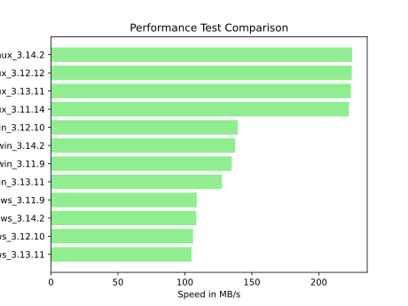

# CloudCrypt
Basic Cloud Storage solution with AES encryption using Fernet

## Requirements
- Active Internet Connection
- Python Version 3.11 or higher
- Storage Device as a mounted directory

A Comprehensive Guide on how to mount remote storage devices can be found [here](https://linuxvox.com/blog/mount-remote-folder-linux/)

### Additional Linux Requirements
- (Only for task scheduling) Package: [systemd](https://systemd.io/) (>=v250)
  
## Installation
This package is currently in prerelease phase. Therefore it is only available at the Test-PyPI Package Index
######
    pip install -i https://test.pypi.org/simple/ cloudcrypt
## Setup
### Verify the installation
The following Code should print out the current version of the package
######
    python -m cloudcrypt -v

### Create Config File
Run the following Code to edit the initial config file
######
    python -m cloudcrypt -c

### Setup remote Storage
Create an empty directory on your remote storage. 
Edit the config File and set the variable **CloudStorage** to the absolute Path of your empty directory.  

### Mirror Local Directory
Edit the config File and set the variable **LocalStorage** to the absolute Path of your local directory. 
Which should be securely saved by your cloud storage

### Generate Key File
#### 1. Option: Generate New Key File
For your first usage: Run the following Code to create a new Key File with a new key
######
    python -m cloudcrypt -a
#### 2. Option: Load Existing Keys
If you already have a Key File: Run the following Code to load your keys. 
Edit the Path to match your existing Filepath for your Key File 
######
    python -m cloudcrypt -l Path/to/Keyfile.keys

### Add a scheduled task
Run the following Code add a scheduled serivce
######
    python -m cloudcrypt -s
**Important:** You have to manually start/enable the service after adding!

### Verify Setup Completion
Run the following Code to see if everything has been set up correctly
######
    python -m cloudcrypt --verifysetup
If a step returns False, please see the according step above

### Mirroring your Storage
TODO...

## Performance

The full sources for the current Performace levels can be seen [here](./Test/testresults.csv)